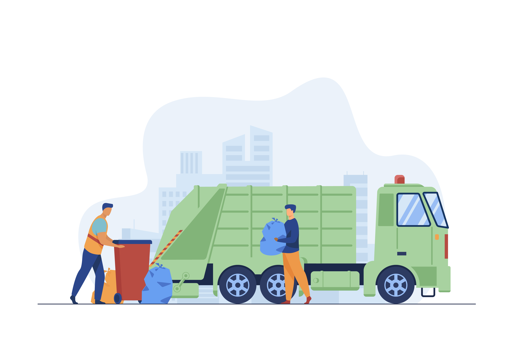
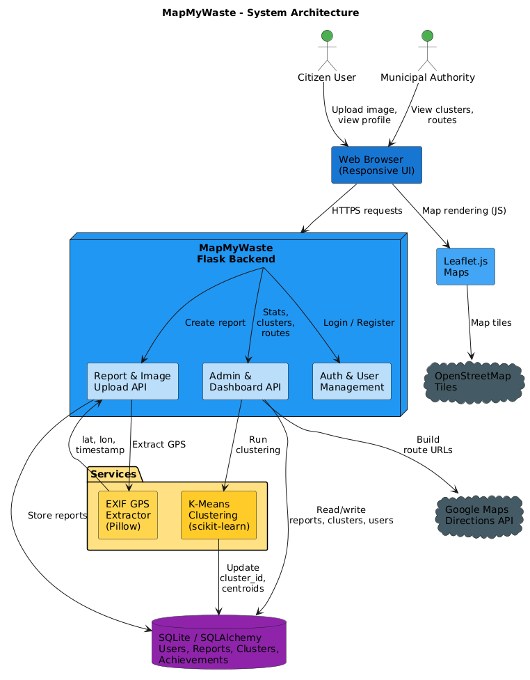

# MapMyWaste

**MapMyWaste** is a Flask-based smart waste reporting and route optimization platform for community-driven cleanliness operations. It helps citizens report garbage hotspots with images and location data, while giving administrators tools to cluster reports, visualize problem zones, and plan efficient collection routes. ♻️



## Overview

MapMyWaste connects public waste reporting with municipal-style operations. Users can upload images, attach GPS coordinates, earn points, and track their impact. Admins can monitor incoming reports, identify duplicate or spam submissions, cluster nearby reports, and manage fleet resources such as trucks, drivers, routes, and assignments.

The project is designed as a practical hackathon-ready prototype with a clear Flask application structure, SQLAlchemy models, Leaflet-powered maps, image processing, gamification, and route planning support.

## Highlights

- 📍 Location-aware waste reporting using EXIF GPS, browser geolocation, manual coordinates, or Chennai defaults
- 🗺️ Interactive map visualization with Leaflet.js and OpenStreetMap
- 🧠 K-means clustering for grouping nearby garbage reports into collection zones
- 🏆 Gamification with points, badges, report counts, and leaderboards
- 🛡️ Duplicate detection using image hashes and filename checks
- 🚛 Admin fleet workflows for trucks, drivers, routes, and assignments
- 📊 Admin dashboard for reports, users, clusters, spam signals, and operational insights
- 🖼️ Image upload handling with validation and secure filenames

## Tech Stack

| Layer | Technology |
| --- | --- |
| Backend | Python, Flask |
| Database | SQLite, SQLAlchemy ORM |
| Authentication | Flask-Login, Werkzeug password hashing |
| Frontend | HTML, CSS, JavaScript, Bootstrap 5 |
| Maps | Leaflet.js, OpenStreetMap |
| ML / Clustering | scikit-learn KMeans, NumPy |
| Image Processing | Pillow, EXIF extraction, MD5 hashing |

## Architecture

MapMyWaste follows a modular Flask architecture with blueprints for public pages, authentication, and admin operations.



```text
User / Admin Browser
        |
        v
Flask Application Factory
        |
        +-- auth blueprint
        |   +-- registration
        |   +-- login / logout
        |
        +-- main blueprint
        |   +-- landing page
        |   +-- waste report upload
        |   +-- dashboard / profile
        |   +-- leaderboard
        |   +-- contact form
        |
        +-- admin blueprint
            +-- report dashboard
            +-- map and clustering
            +-- route optimization
            +-- truck / driver / route management
            +-- fleet assignments

Services Layer
        |
        +-- EXIF GPS extraction
        +-- waste scoring / image hash detection
        +-- K-means clustering
        +-- gamification rules
        +-- sample data generation

Data Layer
        |
        +-- SQLite database
        +-- SQLAlchemy models
        +-- uploaded images
```

### Core Data Flow

1. A user uploads a waste image with optional coordinates and description.
2. The app validates the file, stores it in `uploads/`, and extracts GPS metadata if available.
3. The image is hashed for duplicate detection and scored by the detector service.
4. A `WasteReport` is saved with location, score, spam status, and user ownership.
5. The user receives points and may unlock badges.
6. Admins review reports, run clustering, view map centroids, and plan collection routes.

## Project Structure

```text
MapMyWaste/
├── app/
│   ├── __init__.py              # Flask app factory, extensions, blueprint registration
│   ├── models.py                # SQLAlchemy models for users, reports, fleet, routes
│   ├── admin/
│   │   ├── __init__.py
│   │   └── routes.py            # Admin dashboard, clustering, maps, fleet workflows
│   ├── auth/
│   │   ├── __init__.py
│   │   └── routes.py            # Register, login, logout
│   ├── main/
│   │   ├── __init__.py
│   │   └── routes.py            # Public pages, upload flow, user dashboard
│   ├── services/
│   │   ├── clustering.py        # KMeans clustering service
│   │   ├── detector.py          # Image scoring and MD5 hashing
│   │   ├── exif_utils.py        # GPS extraction from uploaded images
│   │   ├── gamification.py      # Points and badge rules
│   │   └── sample_data.py       # Demo data generation
│   ├── static/
│   │   ├── css/
│   │   └── js/
│   └── templates/
│       ├── admin/
│       ├── auth/
│       ├── main/
│       └── base.html
├── images/                      # README and application images
├── instance/                    # Local SQLite database location
├── model/                       # Optional detector model artifact
├── scripts/                     # Database and schema helper scripts
├── testing_files/               # Integration and database utility scripts
├── uploads/                     # User-uploaded report images
├── config.py                    # App configuration
├── requirements.txt             # Python dependencies
├── run.py                       # Local app entrypoint
└── README.md
```

## Getting Started

### Prerequisites

- Python 3.10 or newer recommended
- `pip`
- A modern browser

### Installation

1. Clone the repository and enter the project folder.

   ```bash
   git clone <your-repository-url>
   cd MapMyWaste
   ```

2. Create and activate a virtual environment.

   ```bash
   python -m venv venv
   venv\Scripts\activate
   ```

   On macOS/Linux:

   ```bash
   python3 -m venv venv
   source venv/bin/activate
   ```

3. Install dependencies.

   ```bash
   pip install -r requirements.txt
   ```

4. Start the application.

   ```bash
   python run.py
   ```

5. Open the app in your browser.

   ```text
   http://localhost:5000
   ```

## Default Admin Login

When `run.py` starts, it creates a development admin account if one does not already exist.

```text
Email: admin@mapmywaste.com
Password: admin123
```

Change these credentials before using the project outside local development.

## Usage

### Citizen Workflow

- Create an account or sign in
- Upload a waste image
- Allow browser location access or provide coordinates manually
- View report confirmation, score, and duplicate status
- Earn points and badges for consistent reporting
- Track personal activity from the dashboard and profile pages

### Admin Workflow

- Sign in with an admin account
- Review total users, reports, recent activity, and cluster counts
- Sort reports by recency or waste score
- Run clustering to group nearby reports
- Open the map view to inspect hotspots and centroids
- Manage trucks, drivers, routes, and daily assignments
- Seed sample data for demos and testing

## Key Pages and Endpoints

| Endpoint | Method | Description |
| --- | --- | --- |
| `/` | GET | Landing page or role-based dashboard redirect |
| `/auth/register` | GET, POST | User registration |
| `/auth/login` | GET, POST | User login |
| `/auth/logout` | GET | User logout |
| `/dashboard` | GET | User dashboard |
| `/upload` | GET, POST | Waste report upload |
| `/report/<id>/result` | GET | Upload result page |
| `/reports/my` | GET | User report history |
| `/profile` | GET | User profile |
| `/leaderboard` | GET | Public leaderboard |
| `/contact` | GET, POST | Contact form |
| `/admin/` | GET | Admin dashboard |
| `/admin/cluster` | POST | Run K-means clustering |
| `/admin/map` | GET | Admin map visualization |
| `/admin/api/reports` | GET | JSON report data for admin map |
| `/admin/optimize-routes` | GET, POST | Route optimization workflow |
| `/admin/truck-assignments` | GET | Fleet assignment dashboard |
| `/admin/manage-trucks` | GET, POST | Truck management |
| `/admin/manage-drivers` | GET, POST | Driver management |
| `/admin/manage-routes` | GET, POST | Route management |

## Data Models

| Model | Purpose |
| --- | --- |
| `User` | Accounts, roles, points, badges, and reporting stats |
| `WasteReport` | Uploaded image reports with location, score, duplicate status, and cluster ID |
| `ContactMessage` | Messages submitted through the contact form |
| `Driver` | Driver profile and availability data |
| `Truck` | Fleet vehicle information and assigned driver |
| `Route` | Collection route metadata and stop coordinates |
| `Assignment` | Scheduled truck, driver, and route pairings |

## Configuration

Most runtime settings live in `config.py`.

| Setting | Purpose |
| --- | --- |
| `SECRET_KEY` | Flask session security key |
| `SQLALCHEMY_DATABASE_URI` | Database connection string |
| `UPLOAD_FOLDER` | Folder for uploaded waste images |
| `MAX_CONTENT_LENGTH` | Maximum upload size |
| `ALLOWED_EXTENSIONS` | Supported image file extensions |
| `DEFAULT_CLUSTERS` | Default number of KMeans clusters |
| `MIN_REPORTS_PER_CLUSTER` | Minimum reports used to estimate cluster count |
| `POINTS_PER_REPORT` | Points awarded per report |
| `DEPOT_LAT`, `DEPOT_LON` | Depot coordinates used for admin routing |

For production, prefer environment variables for sensitive values such as `SECRET_KEY` and `DATABASE_URL`.

## Screenshots

Add or replace screenshots in the `images/` folder as the UI evolves.


Suggested showcase set:

- Dashboard overview
- Waste upload flow
- Admin cluster map
- Fleet assignment view
- Leaderboard and badges

## Hackathon Recognition

MapMyWaste won **First Prize at a National Hackathon in Chennai**. 🏅

This project demonstrates an applied civic-tech idea that combines reporting, geospatial visualization, clustering, and operations planning into one usable prototype.

## Development Notes

- The app uses the Flask application factory pattern in `app/__init__.py`.
- Blueprints keep user, auth, and admin routes separated.
- Database tables are created automatically when `python run.py` starts.
- Uploaded files are stored under `uploads/`.
- Local database files are stored under Flask's instance path when using the default SQLite URI.
- Helper scripts in `scripts/` and `testing_files/` can be used for schema checks, rebuilds, and integration testing.

## Testing and Utilities

Run the available utility scripts as needed:

```bash
python scripts/check_db.py
python scripts/ensure_schema.py
python testing_files/test_integration.py
```

## Roadmap Ideas

- Real-time admin notifications for new high-priority reports
- Better route optimization using distance matrices or OR-Tools
- Role-based dashboards for drivers and field workers
- Report verification workflow with status updates
- Cloud storage for uploaded images
- Production-ready database migrations
- Public analytics page for community impact

## Contributing

Contributions are welcome. Please keep changes focused, test user-facing flows, and document any configuration or database changes.

## License

This project is open source and intended for educational, hackathon, and demonstration use.

## Support

For questions, ideas, or issues, use the contact form inside the application or open an issue in the repository.
